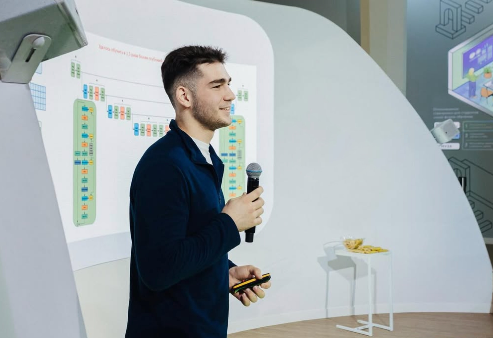

HI! 

I'm Said Azizov, a 20-year-old AI founder with a strong track record in generative AI innovation and language preservation. After winning the AI Journey International competition (1st place) and becoming a prize winner at the National Technological Olympiad, I was invited to Sber AI Research, where I contributed to the development of Kandinsky 3.0, a leading text-to-image model.

As a co-founder of XLabsAI, our team was the first to develop the IP Adapter, as well as pioneering a series of ControlNets and LoRA models, reaching tens of thousands of downloads and significantly impacting the generative AI space. Additionally, demonstrating leadership and commitment to cultural preservation, I led the creation of the first-ever AI translator for the Lezghian language and released its largest open-access linguistic corpus.

Currently, I'm building **NeuroApps**, an innovative marketplace of AI agents with a unified input interface, where a central AI assistant communicates with users and dynamically interacts with specialized agents from the marketplace as needed. NeuroApps is designed as a mutually beneficial platform, empowering developers to monetize their AI skills and enabling users to access advanced, tailored AI solutions seamlessly.

# Personal Details

| Birth | September 30, 2004 |
| --- | --- |
| Mail | [stazizovs@gmail.com](mailto:stazizovs@gmail.com) |
| GitHub | https://github.com/stazizov |
| Kaggle Skills | https://www.kaggle.com/michaelcripman |
| Google Scholar | [Said Azizov](https://scholar.google.com/citations?user=ueDU47EAAAAJ&hl=en&authuser=2) |
| TG Channel (coauthor) | https://t.me/rizzearch |

# Experience

## Founder of [NeuroApps](https://neuroapps.tech)

## **Senior ML Engineer, XLabsAI**

August 2024 - March 2025

- first ip adapter for flux
- first deforum for flux

https://github.com/XLabs-AI/deforum-x-flux

https://github.com/XLabs-AI/x-flux-comfyui

https://github.com/XLabs-AI/x-flux

### ML Researcher, SberAI

January 23, 2024 – august 2024

- Visual Censor
- Kandinsky 4 research and development
- Presentation Generator

### DS Intern, SberAI

July 5, 2023 – December 29, 2023

- Implemented [Kandinsky Deforum](https://github.com/ai-forever/deforum-kandinsky)
- [Kandinsky 3 Technical Report](https://arxiv.org/abs/2312.03511)

# Personal projects

- [first lezghian-russian translato](https://huggingface.co/spaces/leks-forever/lezghian-nllb-200-distilled-600M)r
- [lezghian-russian corpus](https://huggingface.co/leks-forever)
- [community](https://huggingface.co/leks-forever)

### Freelancer

- Development of a system for checking the detection of "low-quality" images
- Collecting customer statistics using images
- Development of a night filter
- Detection of artifacts in histological images of the gastrointestinal tract (GIT).
- Creating a website with various implementations of recommendation systems.

# Education

- National University of Science and Technology MISIS (Moscow, Russia)

# Competitions Experience

- **AIIJC (inclusive environment track), May 2021-November 2021**
    - Task: Developing a solution allowing users to recognize finger spelling letters and individual words of Russian sign language using a neural network.
    - Result: Absolute winner 🥇🏆
- **NTO ATS Olympics, January 2022-May 2022**
    - Task: Computer Vision algorithms for car, robotic arm, drone.
    - Result: 2-nd place 🥈
- **NTO AI Olympics, January 2022-May 2022**
    - Task: Build OCR system for both Russian and English hand-written text.
    - Result: 5-th place
- **TenderHack, October 21-23, 2022**
    - Task: AI-based search engine for the given database with query autocompletion, text and layout correction.
    - Result: 2-nd place 🥈
- **GoCodeHack, November 19-20, 2022**
    - Task: Telegram bot for packaging startups.
    - Result: 1-st place 🥇🏆
- **Google - Isolated Sign Language Recognition**, **Feb 23, 2023 - May 2, 2023**
    - Task: MultiClass Sign Language Classification
    - Result: 58-st place, top 5%, silver medal 🥈
- **Talent Match Hack**
    - RAG, resume matching
    - Result: 1-st place 🥇🏆
- **Digital Breakthrough**
    - multimodal video classification
    - Result: 2 place 🥈
- **True Tech Hack**
    - Adaption of MTS bank website for blind people
    - NER, RAG, sentiment analisys
    - Result: 2 place 🥈
